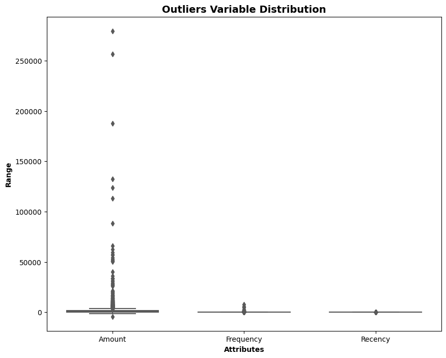
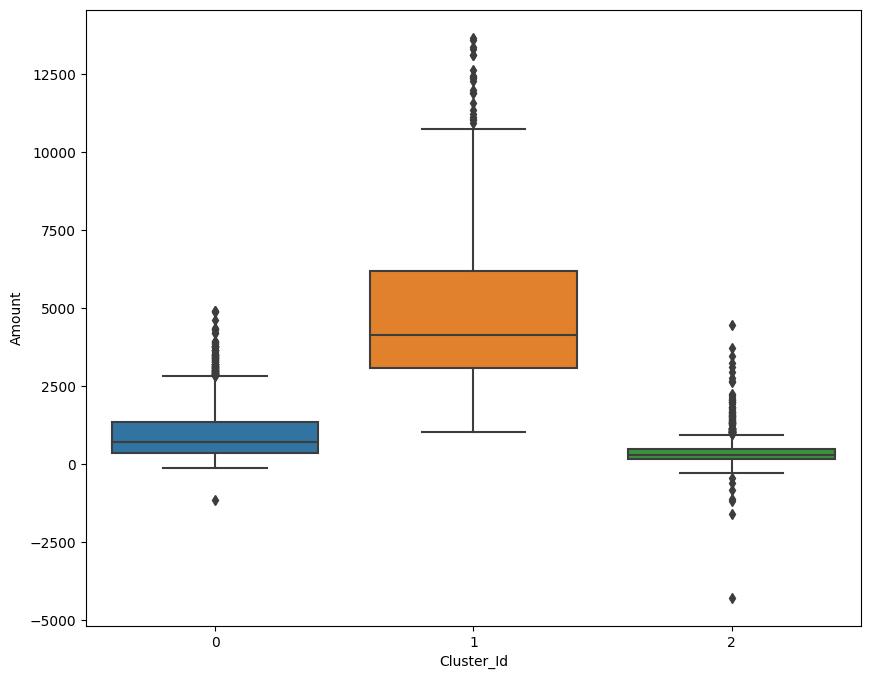
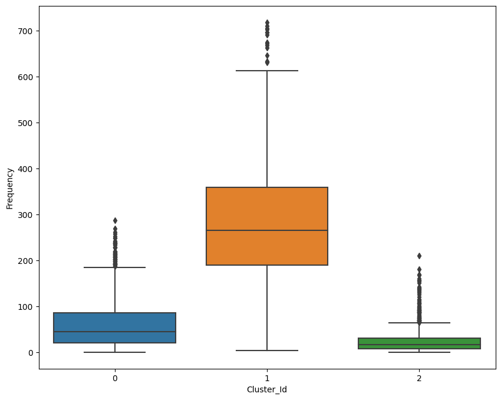
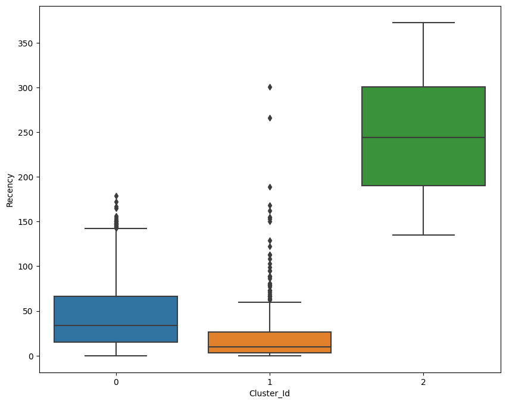
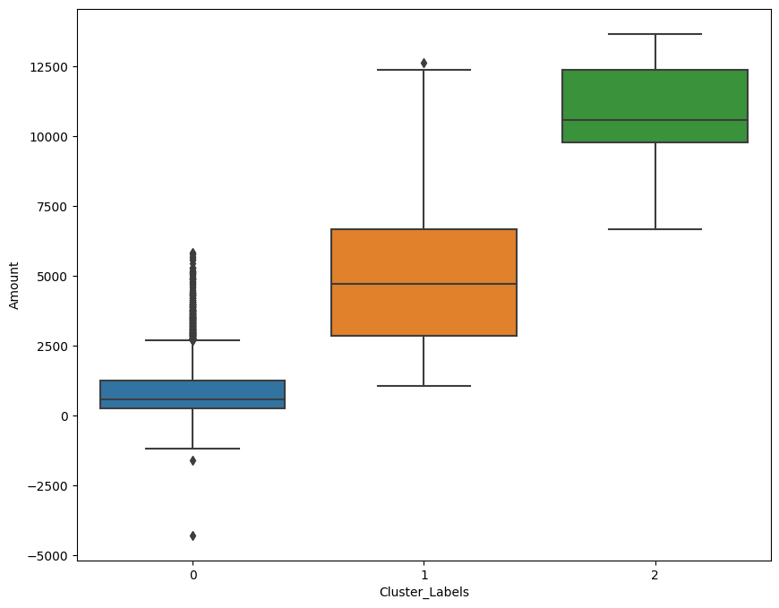
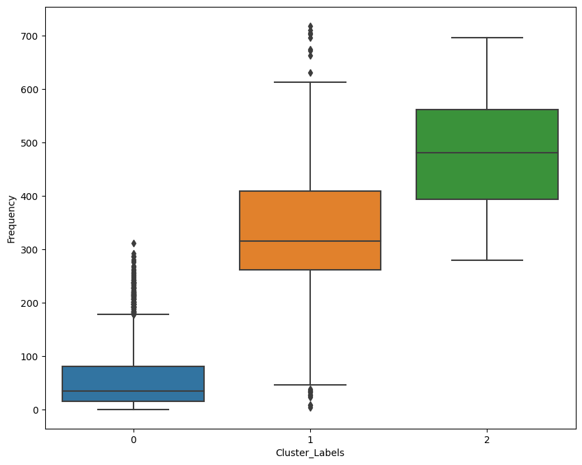
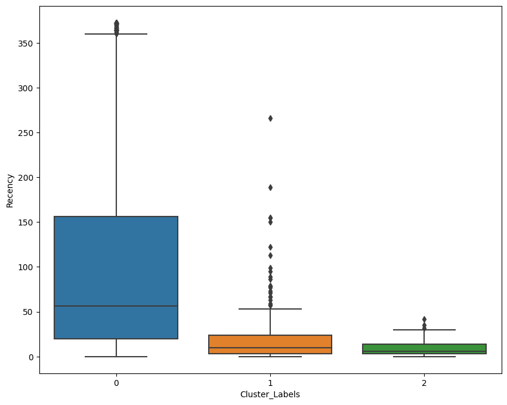
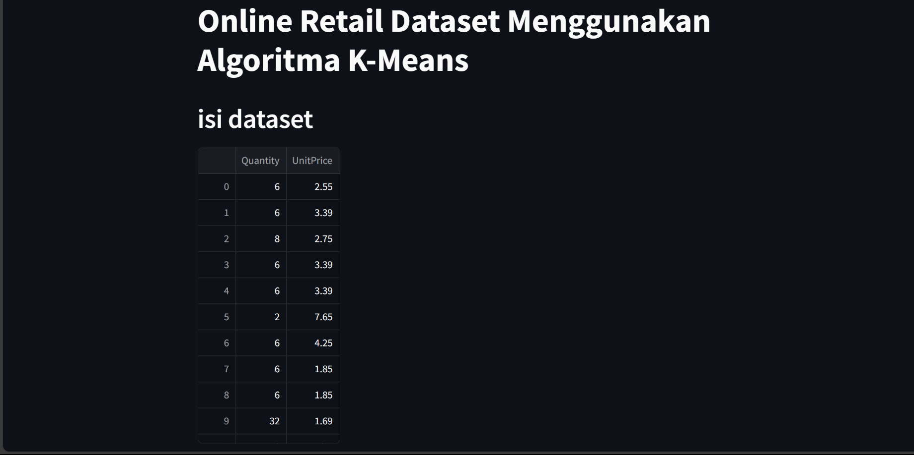

# Laporan Proyek Machine Learning

### Nama : Anugerah Fadhil Rachman

### Nim : 211351021

### Kelas : Pagi A

## Domain Proyek

Pada Proyek ini bertujuan untuk melakukan analisis clustering menggunakan algoritma K-Means dan Hierarchical Clustering pada data penjualan Online Retail. Data tersebut mencakup informasi tentang produk, pelanggan, dan transaksi penjualan.

## Business Understanding

Pada proyek ini, masalah bisnis yang ingin diselesaikan adalah untuk membangun pengelompokan RFM dan memilih kelompok pelanggan terbaik yang harus ditargetkan oleh perusahaan.

### Problem Statement

- Bagaimana cara mengkelompokan RFM untuk memilih pelanggan terbaik?
- Bagaimana perusahaan mendapatkan data yang lebih akurat?

### Goals

- Menggunakan K-Means untuk mengidentifikasi kelompok pelanggan dengan pola pembelian serupa dan memahami karakteristik setiap segmen pelanggan.
- Membantu dalam merancang strategi pemasaran yang lebih terfokus untuk setiap segmen dan memaksimalkan efektivitas promosi dan penawaran khusus.
- Memahami kebutuhan dan preferensi setiap segmen pelanggan, mengembangkan strategi retensi yang sesuai untuk meningkatkan loyalitas pelanggan.
- Menganalisis performa produk di setiap segmen untuk meningkatkan penjualan, mengidentifikasi produk yang paling diminati oleh masing-masing kelompok pelanggan.

  ### Solution statements

  - Dengan menggunakan algoritma K-means dan Hierarchical Clustering, kita dapat membagi pelanggan online retail menjadi kelompok-kelompok yang memiliki kesamaan dalam perilaku pembelian.
  - Dengan mengetahui kelompok-kelompok pelanggan yang berbeda, perusahaan dapat melakukan personalisasi dalam strategi pemasaran.
  -  Dengan memahami perilaku pembelian pelanggan, perusahaan dapat mengidentifikasi pelanggan yang cenderung churn atau berhenti berbelanja.

## Data Understanding

Untuk Proyek ini saya menggunakan data yang berasal dari kaggle. Dataset ini memiliki 8 Atribut,tetapi yang digunakan dalam proyek ini hanya 2.

Dataset yang digunakan: [Online Retail](https://www.kaggle.com/datasets/hellbuoy/online-retail-customer-clustering/data).

### Variabel-variabel pada Online Retail Dataset adalah sebagai berikut:

| Nomer | Variabel           | Tipe Data | Keterangan                           |
| ----- | ------------------ | :-------: | ------------------------------------ |
| 1     | InvoiceNo                |   String  | Berisi kode pembelian           |
| 2     | StockCode                |  String  | Berisi kode stok                |
| 3     | Description             |  Integer   | Berisi keterangan produk       |
| 4     | Quantity          |  Integer   | Berisi kualitas barang  |
| 5     | InvoiceDate             |  Date  | Berisi Tanggal & waktu pemesanan          |
| 6     | UnitPrice            |   Integer   | Berisi harga barang             |
| 7     | CustomerID |   Integer   | Berisi nomor urutan |
| 8     | Country           |   String   | berisi negara         |

#### Variabel-variabel pada Online Retail Dataset yang digunakan dalam proyek ini adalah sebagai berikut:

| Nomer | Variabel | Tipe Data | Keterangan                   |
| ----- | -------- | :-------: | ---------------------------- |
| 1     | Quantity      |  Integer  | Berisi kualitas barang        |
| 2     | UnitPrice   |  Integer  | Berisi harga barang  |

**Rubrik/Kriteria Tambahan (Opsional)**:

- Visualisai Data
  <br>
  
  <br>
  
  <br>
  
  <br>
  
    <br>
  
    <br>
  
    <br>
  

## Data Preparation

Beberapa penggunaan algoritma K-Means yang saya gunakan untuk mengelompokan Customer berdasarkan Quantity dan UnitPrice, teknik persiapan data mencakup langkah-langkah yang saya lakukan ialah :


```python
!kaggle datasets download -d hellbuoy/online-retail-customer-clustering
```

```python
!unzip online-retail-customer-clustering.zip -d online-retail-customer-clustering
!ls online-retail-customer-clustering
```

```python
  df = pd.read_csv('/content/online-retail-customer-clustering/OnlineRetail.csv', sep=",", encoding="ISO-8859-1", header=0)
```


```python
import numpy as np
import pandas as pd
import matplotlib.pyplot as plt
import seaborn as sns
import datetime as dt
from sklearn.cluster import KMeans
import plotly.graph_objects as go
import sklearn
import plotly.express as px
from sklearn.preprocessing import StandardScaler
from sklearn.cluster import KMeans
from scipy.cluster.hierarchy import cut_tree
```


```python
rfm = pd.merge(rfm, rfm_p, on='CustomerID', how='inner')
rfm.columns = ['CustomerID', 'Amount', 'Frequency', 'Recency']
rfm.head()
```


```python
rfm_df = rfm[['Amount', 'Frequency', 'Recency']]

scaler = StandardScaler()

rfm_df_scaled = scaler.fit_transform(rfm_df)
rfm_df_scaled.shape
```

```python
rfm_df_scaled = pd.DataFrame(rfm_df_scaled)
rfm_df_scaled.columns = ['Amount', 'Frequency', 'Recency']
rfm_df_scaled.head()
```


```python
ssd = []
range_n_clusters = [2, 3, 4, 5, 6, 7, 8]
for num_clusters in range_n_clusters:
    kmeans = KMeans(n_clusters=num_clusters, max_iter=50)
    kmeans.fit(rfm_df_scaled)

    ssd.append(kmeans.inertia_)

plt.plot(ssd)

```


```python
kmeans = KMeans(n_clusters=3, max_iter=50)
kmeans.fit(rfm_df_scaled)
```

```python
sse = []
for i in range(1, 9):
    kmeans = KMeans(n_clusters=i, max_iter=300)
    kmeans.fit(x)
    sse.append(kmeans.inertia_)

# Plot the SSE vs. number of clusters
fig = px.line(y=sse, template="seaborn", title='Elbow Method')
fig.update_layout(
    width=800,
    height=600,
    title_font_color="#BF40BF",
    xaxis=dict(color="#BF40BF", title="Clusters"),
    yaxis=dict(color="#BF40BF", title="SSE")
)

fig.show()
```

## Modeling

K-means clustering adalah algoritma yang digunakan untuk mengelompokkan data ke dalam klaster berdasarkan kesamaan fitur atau atribut. Dalam konteks online retail, K-means clustering dapat digunakan untuk mengelompokkan pelanggan berdasarkan perilaku pembelian mereka.

Selain itu, tujuan lain dari algoritma K-Means adalah untuk meminimalkan nilai fungsi inersia sehingga klaster-klaster yang dihasilkan memiliki kompak dan terpisah dengan jelas.

```python
kmeans = KMeans(n_clusters=4, max_iter=50)
kmeans.fit(rfm_df_scaled)
```

<br>
- Berikut terdapat beberapa kelebihan yang ada pada algoritma K-Means:

- Sederhana dan Cepat: K-means memiliki implementasi yang sederhana dan dapat dijalankan dengan cepat pada dataset besar. Algoritma ini efisien dan cocok untuk pemrosesan data real-time.
- Skalabilitas: K-means dapat dengan mudah diaplikasikan pada dataset dengan jumlah fitur yang besar.
- Interpretasi yang Mudah: Hasil clustering K-means dapat dengan mudah diinterpretasikan. Setiap klaster memiliki pusat yang mewakili karakteristik klaster tersebut.
- Dapat Menangani Data Numerik: K-means cocok untuk data numerik, terutama jika data memiliki distribusi yang jelas dan terdapat perbedaan yang signifikan antara klaster.

<br>
- Berikut terdapat beberapa kekurangan dalam penggunaan algoritma K-Means:

- Sensitif terhadap Pusat Awal: Hasil clustering K-means dapat berbeda tergantung pada inisialisasi pusat klaster awal. Pemilihan pusat klaster yang buruk dapat menghasilkan solusi yang tidak optimal.
- Memerlukan Jumlah Klaster yang Diketahui: K-means memerlukan jumlah klaster yang diketahui sebelumnya. Jika jumlah klaster tidak diketahui, pemilihan jumlah klaster yang tepat dapat menjadi tantangan.
- Rentan terhadap Outlier: K-means rentan terhadap adanya outlier dalam data. Outlier dapat mempengaruhi lokasi pusat klaster dan menghasilkan klaster yang tidak representatif.
- Hanya Cocok untuk Bentuk Klaster yang Sederhana: K-means cenderung menghasilkan klaster dengan bentuk yang sederhana, seperti bola atau elips. Jika klaster memiliki bentuk yang kompleks atau berbentuk cincin, K-means mungkin tidak menghasilkan hasil yang baik.

## Evaluation

SSE (Sum of Squared Errors): SSE adalah metode evaluasi yang mengukur sejauh mana setiap titik data dalam klaster berada dari pusat klasternya. SSE dihitung sebagai jumlah kuadrat jarak antara setiap titik data dengan pusat klasternya, kemudian dijumlahkan untuk semua titik data dalam klaster. Tujuan dari K-means adalah untuk meminimalkan SSE.
Rumus SSE untuk K-means adalah sebagai berikut: 
SSE = Σ (xi - ci)^2
SSE: Sum of Squared Errors
xi: Titik data ke-i
ci: Pusat klaster dari titik data ke-i
Semakin kecil nilai SSE, semakin baik hasil clustering K-means. Namun, perlu diingat bahwa SSE cenderung menurun seiring dengan peningkatan jumlah klaster. Oleh karena itu, SSE tidak dapat digunakan sebagai satu-satunya metode untuk memilih jumlah klaster yang optimal.

Elbow Method:Elbow Method adalah metode grafis yang digunakan untuk memilih jumlah klaster yang optimal dalam K-means. Metode ini melibatkan plot nilai SSE terhadap jumlah klaster yang berbeda, kemudian mencari "siku" dalam plot yang disebut sebagai "elbow".
Langkah-langkah dalam menggunakan Elbow Method adalah sebagai berikut:
- Jalankan K-means dengan berbagai jumlah klaster.
- Hitung SSE untuk setiap jumlah klaster.
- Plot nilai SSE terhadap jumlah klaster.
- Identifikasi titik di plot yang menunjukkan penurunan SSE yang signifikan dan membentuk "elbow" atau "siku".
- Jumlah klaster di titik "elbow" tersebut dapat dipilih sebagai jumlah klaster yang optimal.
- Grafik Elbow Method membantu dalam menentukan jumlah klaster yang memberikan keseimbangan antara penurunan SSE yang signifikan dan kompleksitas model. Namun, penting untuk diingat bahwa interpretasi "elbow" pada grafik subjektif dan tergantung pada data dan konteks spesifik.
## Deployment

Link Streamlit : [Online Retail](https://onlineretail-55mzqtqp2weny2ececpnff.streamlit.app/)

